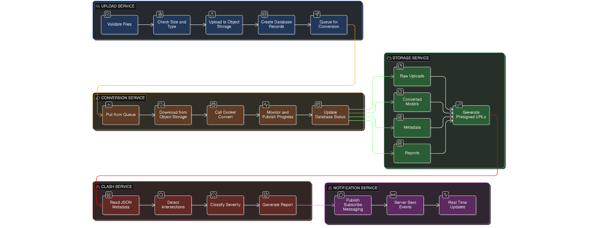
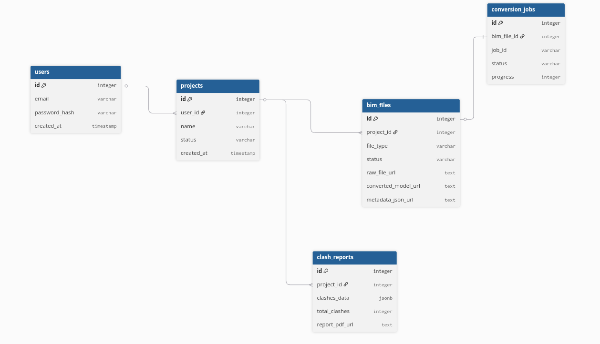

# BIM Assistant - System Design Document

##  Table of Contents
1. [System Overview](#system-overview)
2. [Requirements & Trade-offs](#requirements--trade-offs)
3. [Architecture Diagrams](#architecture-diagrams)
4. [Frontend Design](#frontend-design)
5. [Backend Design](#backend-design)
6. [Database Schema](#database-schema)
7. [API Documentation](#api-documentation)
8. [File Processing Pipeline](#file-processing-pipeline)
9. [Storage Strategy](#storage-strategy)

---

##  System Overview

BIM Assistant is a web-based Building Information Modeling platform that enables users to:
- Upload and convert IFC files to web-friendly formats
- Visualize 3D building models
- Detect clashes between different building systems
- Manage multiple projects
- Generate comprehensive reports

### Key Technologies
- **Frontend**: React + TypeScript + Vite + Three.js
- **Backend**: Node.js + Express
- **Queue System**: RabbitMQ
- **Database**: PostgreSQL
- **Object Storage**: MinIO (S3-compatible)
- **IFC Processing**: Python + IfcOpenShell
- **Containerization**: Docker + Docker Compose

---

##  Requirements & Trade-offs

### Functional Requirements

#### Core Requirements (Must Have - MVP)
```
┌─────────────────────────────────────────────────────────────────┐
│                    CORE FUNCTIONALITY                           │
└─────────────────────────────────────────────────────────────────┘

1. USER MANAGEMENT
    User registration and authentication
    Login/logout functionality
    Session management (JWT tokens)
    Password reset capability
   
   Why Critical: Security and user data isolation

2. PROJECT MANAGEMENT
    Create new projects
    List all user projects
    View project details
    Delete projects
   
   Why Critical: Core organizational unit

3. FILE UPLOAD & CONVERSION
    Upload IFC files (single or multiple)
    Validate file format and size
    Convert IFC to GLB format
    Separate models by category
    Store in object storage
   
   Why Critical: Primary value proposition

4. 3D VISUALIZATION
    Display 3D models in browser
    Toggle model categories on/off
    Basic camera controls (orbit, pan, zoom)
    Reset view functionality
   
   Why Critical: User needs to see models

5. PROGRESS TRACKING
    Real-time conversion progress
    Status updates (pending/processing/completed)
    Error handling and display
   
   Why Critical: User feedback for long operations

6. CLASH DETECTION
    Detect intersections between elements
    Generate clash report
    View clashes in table format
   
   Why Critical: Core BIM functionality
```


### Critical Trade-offs Analysis

```
┌─────────────────────────────────────────────────────────────────┐
│                      TRADE-OFF DECISIONS                        │
└─────────────────────────────────────────────────────────────────┘

1. REDIS vs RABBITMQ for Message Queue
   ━━━━━━━━━━━━━━━━━━━━━━━━━━━━━━━━━━━━━━━━━━━━━━━━━━━━━━━━━━━━
   DECISION: RabbitMQ 
   
   PROS:
    Dedicated message broker (built for queuing)
    Language agnostic (Node.js backend + Python workers)
    Advanced routing & exchanges (flexible workflows)
    Better message persistence & durability
    Built-in clustering & high availability
    Excellent monitoring (Management UI)
    Industry standard for polyglot architectures
    No need for Redis at all (simpler stack)
   
   CONS:
    More memory (~150-200MB vs Redis 50MB)
    Slightly steeper learning curve
    More complex configuration initially
   
   WHY THIS CHOICE:
   Architecture has Node.js backend + Python conversion worker.
   RabbitMQ excels at polyglot communication. Since we don't need
   Redis for caching (PostgreSQL is fast enough for <500 users),
   RabbitMQ eliminates Redis dependency entirely. One less service
   to maintain = simpler architecture.
   
   Redis+BullMQ ALTERNATIVE:
   Would make sense if:
   • Need Redis for caching anyway
   • Pure Node.js architecture (no Python)
   • Want faster MVP setup
   
   But without caching need, Redis becomes overhead.

2. POSTGRESQL vs MONGODB
   ━━━━━━━━━━━━━━━━━━━━━━━━━━━━━━━━━━━━━━━━━━━━━━━━━━━━━━━━━━━━
   DECISION: PostgreSQL 
   
   PROS:
    ACID transactions (data integrity)
    Relational data (users, projects, files)
    JSONB support (flexible for clash data)
    Mature ecosystem and tooling
    Strong consistency
    Advanced indexing (GIN, BRIN)
   
   CONS:
    Vertical scaling limits
    Schema migrations required
    Overkill for simple key-value
   
   WHY THIS CHOICE:
   BIM data has clear relationships (users → projects → files).
   Need transactions for consistency. JSONB gives flexibility
   for clash detection data without sacrificing relational benefits.
   
   WHEN TO RECONSIDER:
   • Massive scale (billions of records)
   • Schemaless data dominates
   • Geographic distribution critical

3. MINIO vs AWS S3
   ━━━━━━━━━━━━━━━━━━━━━━━━━━━━━━━━━━━━━━━━━━━━━━━━━━━━━━━━━━━━
   DECISION: MinIO (Development)
   
   PROS (MinIO):
    Self-hosted (no cloud costs in dev)
    S3-compatible API (easy migration)
    Docker-friendly
    Full control over data
    Good for development/testing
   
   CONS (MinIO):
    Operational overhead
    Limited HA without distributed mode
    Manual backup/disaster recovery
   
   WHY THIS CHOICE:
   MinIO for dev/staging keeps costs down and provides S3-compatible
   API. Production can use AWS S3 for durability (99.999999999%)
   and managed service benefits with zero code changes.
   
   WHEN TO USE S3:
   • Production deployment
   • Critical data durability
   • Need CDN integration
   • Global availability required

4. REAL-TIME: WEBSOCKET vs SERVER-SENT EVENTS (SSE)
    ━━━━━━━━━━━━━━━━━━━━━━━━━━━━━━━━━━━━━━━━━━━━━━━━━━━━━━━━━━━━
    DECISION: Server-Sent Events (SSE)
    
    PROS:
     Simple HTTP-based protocol
     No connection state to manage
     Automatic reconnection built-in
     Works over standard HTTP/HTTPS
     Easier to scale (no sticky sessions)
     Lower memory overhead
     Native browser support
    
    CONS:
     One-directional (server→client only)
     Text-based (no binary data)
     Limited to ~6 concurrent connections per browser
    
    WHY THIS CHOICE:
    Progress updates are one-directional (server→client). SSE's 
    simplicity, better scalability, and reduced overhead make it ideal 
    for MVP. No need for bidirectional communication yet. Can migrate 
    to WebSocket later if collaborative features require it.
    
    WHEN TO RECONSIDER:
    • Need real-time user collaboration (comments, live cursors)
    • Require client→server messaging (besides HTTP requests)
    • Browser limitations become an issue (unlikely)

5. SYNCHRONOUS vs ASYNCHRONOUS Processing
   ━━━━━━━━━━━━━━━━━━━━━━━━━━━━━━━━━━━━━━━━━━━━━━━━━━━━━━━━━━━━
   DECISION: Asynchronous (RabbitMQ) 
   
   PROS:
    Non-blocking API responses
    Parallel processing (3-5 workers)
    Retry failed jobs automatically
    Better user experience (no timeout)
    Scale workers independently
   
   CONS:
    More complex architecture
    Eventual consistency
    Need progress tracking system
   
   WHY THIS CHOICE:
   IFC conversion takes 2-5 minutes per file. Synchronous would:
   • Block HTTP connection (timeout after 30-60s)
   • No parallel processing
   • Poor user experience
   
   Async allows:
   • Upload 5 files → return immediately
   • Process in parallel → 3x faster
   • Real-time progress updates
   • Better resource utilization

6. MONOLITH vs MICROSERVICES
   ━━━━━━━━━━━━━━━━━━━━━━━━━━━━━━━━━━━━━━━━━━━━━━━━━━━━━━━━━━━━
   DECISION: Monolith 
   
   PROS:
    Simpler deployment (single Docker image)
    Easier debugging
    Lower latency (no network calls)
    Faster development (no service boundaries)
    Easier transactions
   
   CONS:
    All-or-nothing deployment
    Harder to scale specific features
    Technology lock-in
   
   WHY THIS CHOICE:
   MVP with small team (1-3 developers). Microservices add:
   • Network complexity
   • Service discovery
   • Distributed tracing
   • API versioning
   • More DevOps overhead
   
   Monolith gets MVP to market 2-3x faster. Can extract
   microservices later when specific bottlenecks emerge.
   
   WHEN TO SPLIT:
   • Team grows > 10 developers
   • Clear service boundaries emerge
   • Different scaling needs (conversion heavy)
   • Need independent deployments

7. STORING CONVERTED FILES: DATABASE vs OBJECT STORAGE
   ━━━━━━━━━━━━━━━━━━━━━━━━━━━━━━━━━━━━━━━━━━━━━━━━━━━━━━━━━━━━
   DECISION: Object Storage (MinIO/S3) 
   
   PROS:
    Designed for large files
    Unlimited scalability
    Built-in redundancy
    CDN integration
    Lower cost per GB
    Presigned URLs for secure access
   
   CONS:
    External dependency
    Network latency
    More complex backup
   
   WHY THIS CHOICE:
   PostgreSQL max row size: 1GB (but slow)
   Average GLB file: 10-50 MB per category
   Project with 5 files: ~500 MB total
   
   Database would:
   • Bloat quickly (100 projects = 50 GB)
   • Slow queries
   • Expensive backups
   • No CDN integration
   
   Object Storage:
   • Pay per GB used
   • Fast parallel downloads
   • Easy CDN setup
   • Built for this use case

8. CACHING STRATEGY: SIMPLE vs COMPLEX
   ━━━━━━━━━━━━━━━━━━━━━━━━━━━━━━━━━━━━━━━━━━━━━━━━━━━━━━━━━━━━
   DECISION: Simple HTTP Caching (No Redis Cache) 
   
   LAYERS:
    Browser Cache (Static assets)
      Cache-Control: max-age=31536000 (1 year)
      GLB files, images, CSS, JS
      
    HTTP ETag/Last-Modified Headers
      For dynamic API responses
      Client sends If-None-Match → 304 Not Modified
      Zero bandwidth if unchanged
   
    CDN Cache (Optional for production)
      CloudFlare or similar
      Cache GLB models at edge
      Reduces origin load
   
    PostgreSQL Query Cache
      Automatic for repeated queries
      No configuration needed
   
   WHY SIMPLE CACHING:
    PostgreSQL is fast (<100ms for typical queries)
    <500 users don't need Redis cache layer
    HTTP caching is standard and works everywhere
    Less complexity = fewer bugs
    One less service to maintain (no Redis)
    Browser cache handles 90% of optimization
   
   WHEN TO ADD REDIS CACHE:
   • Query times consistently >200ms
   • Database becomes bottleneck
   • >1000 concurrent users
   • Specific slow queries identified
   
   TRADE-OFF:
   Simplicity vs Ultra-Performance
   For MVP, simple caching is 90% of benefit with 10% of complexity.
   
   CACHE INVALIDATION:
   Simpler without Redis layer:
   • Browser cache: Long-lived (immutable URLs)
   • ETag: Automatic validation on each request
   • Models: Immutable (change URL to invalidate)
   • CDN: Purge via API when needed

9. JSON METADATA: PERMANENT vs TEMPORARY
   ━━━━━━━━━━━━━━━━━━━━━━━━━━━━━━━━━━━━━━━━━━━━━━━━━━━━━━━━━━━━
   DECISION: Permanent Storage 
   
   PROS:
    Required for clash detection
    Needed for ML classification
    Fast queries (no IFC re-parsing)
    Analytics and reporting
    Element property search
   
   CONS:
    Potential data duplication
   
   
   BENEFIT:
   • Clash detection: 100x faster (no re-parsing)
   • ML training: Direct data access
   • Search: "Find all 200mm pipes" in milliseconds
   • Reports: Instant data retrieval
   
   RE-PARSING IFC EVERY TIME:
   • 2-5 minutes per file
   • Heavy CPU usage
   • User waits for every clash report
   
   Storing JSON: Tiny cost, massive benefit
```

### Constraints & Limitations

```
┌───────────────────────────────────────────┐
│           SYSTEM CONSTRAINTS              │
└───────────────────────────────────────────┘

TECHNICAL CONSTRAINTS:
━━━━━━━━━━━━━━━━━━━━━━━━━━━━━━━━━━━━━━━━━━━━━━━━━━━━━━━━━━━━━━━━━

1. File Size Limits
   ────────────────
   Max IFC File:        500 MB
   Why:                 Browser upload limits, conversion time
   Workaround:          Split large files or enterprise tier
   
2. Browser Limitations
   ───────────────────
   WebGL Max Vertices:  ~16 million
   Max Texture Size:    8192×8192 pixels
   Memory:              2-4 GB (mobile browsers)
   Why:                 Hardware constraints
   Workaround:          LOD (Level of Detail), progressive loading
   
3. Conversion Time
   ───────────────
   Per File:            2-5 minutes
   Complex Models:      Up to 10 minutes
   Why:                 IFC parsing + geometry processing
   Workaround:          Parallel processing, async jobs

```

### Decision Log

```
┌─────────────────────────────────────────────────────────────────┐
│              ARCHITECTURAL DECISION RECORD                      │
└─────────────────────────────────────────────────────────────────┘

DECISION 1: Use Docker Compose (not Kubernetes)
───────────────────────────────────────────────
Context: Need containerization for dev/prod consistency
Decision: Docker Compose for MVP, migrate to K8s later
Rationale: Simpler for small team, 90% of K8s benefits
Consequences: Manual scaling, less HA, easier debugging

DECISION 2: Separate Dockerfiles for Dev/Prod
──────────────────────────────────────────────
Context: Dev needs hot-reload, Prod needs optimization
Decision: Dockerfile.dev + Dockerfile per service
Rationale: Dev speed vs Prod efficiency trade-off
Consequences: 2x maintenance, but worth it

DECISION 3: Store Metadata as JSONB in PostgreSQL
──────────────────────────────────────────────────
Context: Clash data is semi-structured
Decision: JSONB columns for flexible data
Rationale: Relational + NoSQL benefits
Consequences: Great for queries, careful indexing needed

DECISION 4: Use RabbitMQ for Message Queue
───────────────────────────────────────────
Status:  Accepted
Context: Need job queue for IFC conversions (Node.js + Python)
Decision: RabbitMQ for message queuing
Rationale: Language-agnostic, no Redis needed, better for polyglot
Consequences: Slightly more complex setup, but cleaner architecture

DECISION 5: No Redis Cache Layer (Simple HTTP Caching)
───────────────────────────────────────────────────────
Status:  Accepted
Context: Need to optimize API responses for <500 users
Decision: HTTP caching (ETag, browser cache) only
Rationale: PostgreSQL fast enough, simpler stack, less overhead
Consequences: May need Redis later at scale, but MVP is simpler

DECISION 6: Use SSE over WebSocket for Progress Updates
────────────────────────────────────────────────────────
Status:  Accepted
Context: Need progress updates during conversion
Decision: Server-Sent Events (SSE) for one-way updates
Rationale: Simpler than WebSocket, sufficient for progress tracking
Consequences: One-directional only, but that's all we need

```


---

##  Architecture Diagrams

### High-Level System Architecture

```
┌─────────────────────────────────────────────────────────────────┐
│                         USER BROWSER                            │
│  ┌──────────────┐  ┌──────────────┐  ┌──────────────┐           │
│  │  Home Page   │  │   Projects   │  │ Project View │           │
│  │              │→ │    Page      │→ │   (3D View)  │           │
│  └──────────────┘  └──────────────┘  └──────────────┘           │
└────────────────────────────┬────────────────────────────────────┘
                             │ HTTPS
                             ↓
┌────────────────────────────────────────────────────┐
│                      FRONTEND (React)              │
│  ┌───────────────────────────────────────────┐     │
│  │  Components:                              │     │
│  │  - Sidebar Navigation                     │     │
│  │  - Upload Modal                           │     │
│  │  - 3D Canvas (Three.js)                   │     │
│  │  - Visual Controls                        │     │
│  │  - Progress Indicators                    │     │
│  │  - Clash Report Viewer                    │     │
│  └───────────────────────────────────────────┘     │
└────────────────────────────┬───────────────────────┘
                             │ REST API + SSE
                             ↓
┌───────────────────────────────────────────────────────────────┐
│                    API GATEWAY (Express)                      │
│  ┌───────────────┐  ┌──────────────┐  ┌───────────────┐       │
│  │  Auth Routes  │  │ File Routes  │  │ Report Routes │       │
│  └───────────────┘  └──────────────┘  └───────────────┘       │
└──────┬──────────────────┬──────────────────┬──────────────────┘
       │                  │                  │
       ↓                  ↓                  ↓
┌──────────────┐  ┌──────────────┐  ┌──────────────┐
│  PostgreSQL  │  │   RabbitMQ   │  │    MinIO     │
│  (Metadata)  │  │   (Queue)    │  │ (File Store) │
│              │  │              │  │              │
└──────────────┘  └──────┬───────┘  └──────────────┘
                         │
                         ↓
                  ┌──────────────┐
                  │   Workers    │
                  │  (Python)    │
                  │              │
                  │ - Converter  │
                  │ - Clash Det. │
                  │ - ML Proc.   │
                  └──────────────┘
                         │
                         ↓
                  ┌──────────────┐
                  │ IFC Converter│
                  │   (Docker)   │
                  │  IfcOpenShell│
                  └──────────────┘
```

### Detailed Data Flow

```
┌─────────────────────────────────────────────────────────────────┐
│                    FILE UPLOAD WORKFLOW                          │
└─────────────────────────────────────────────────────────────────┘

USER UPLOADS FILES
   ┌──────────┐
   │  User    │ Selects 3-5 IFC files
   └────┬─────┘
        │
        ↓ POST /api/upload (multipart/form-data)
   ┌──────────────────┐
   │  Express Server  │
   │  (Multer)        │
   └────┬─────────────┘
        │
        ↓ Validate files (size, type)
   ┌──────────────────┐
   │  File Validator  │ Max 500MB/file, .ifc only
   └────┬─────────────┘
        │
        ├─→ Upload to MinIO (raw-uploads/)
        │
        ├─→ Create DB records (BIM_Files)
        │   └─→ Status: 'pending'
        │
        └─→ Publish to RabbitMQ Queue
            ├─→ Job 1: file1.ifc (Priority: High)
            ├─→ Job 2: file2.ifc (Priority: High)
            └─→ Job 3: file3.ifc (Priority: High)

2. PARALLEL PROCESSING
   ┌────────────────────────────────────────────────┐
   │         RabbitMQ Queue (conversion)            │
   │                                                │
   │  ┌──────┐  ┌──────┐  ┌──────┐  ┌──────┐        │
   │  │Job 1 │  │Job 2 │  │Job 3 │  │Job 4 │        │  
   │  └──┬───┘  └──┬───┘  └──┬───┘  └──────┘        │
   └─────┼─────────┼─────────┼──────────────────────┘
         │         │         │
         ↓         ↓         ↓
   ┌─────────┐ ┌─────────┐ ┌─────────┐
   │Worker 1 │ │Worker 2 │ │Worker 3 │ (Python - 3-5 workers)
   └────┬────┘ └────┬────┘ └────┬────┘
        │           │           │
        ↓           ↓           ↓
   ┌────────────────────────────────────┐
   │    IFC Converter Container         │
   │    (Python + IfcOpenShell)         │
   │                                     │
   │  1. Parse IFC → Extract geometry   │
   │  2. Separate by category:          │
   │     - Walls                        │
   │     - Ducts                        │
   │     - Electrical                   │
   │     - Pipes                        │
   │     - Others                       │
   │  3. Convert to GLB format          │
   │  4. Generate JSON metadata         │
   └────────┬───────────────────────────┘
            │
            ├─→ Upload GLB → MinIO (converted-models/)
            ├─→ Upload JSON → MinIO (metadata/)
            └─→ Update DB: Status = 'completed'

3. REAL-TIME UPDATES
   ┌──────────────┐
   │   Worker     │
   │  (Python)    │
   └──────┬───────┘
          │
          ├─→ Progress: 0% → PostgreSQL update
          ├─→ Progress: 25% → PostgreSQL update
          ├─→ Progress: 50% → PostgreSQL update
          ├─→ Progress: 75% → PostgreSQL update
          └─→ Progress: 100% → PostgreSQL update
                    │
                    ↓
          ┌─────────────────┐
          │   SSE Endpoint  │
          │  /api/progress  │
          │   (polling DB)  │
          └────────┬────────┘
                   │
                   ↓
          ┌─────────────────┐
          │   Frontend      │
          │ (Progress Bar)  │
          └─────────────────┘
```

---

##  Frontend Design

### Page Structure

```
src/
├── pages/
│   ├── HomePage.tsx           # Landing page with features
│   ├── LoginPage.tsx          # User authentication
│   ├── RegisterPage.tsx       # User registration
│   ├── ProjectsPage.tsx       # List all user projects
│   ├── ProjectViewPage.tsx    # 3D model viewer + controls
│   └── ReportPage.tsx         # Clash detection report
│
├── components/
│   ├── Layout/
│   │   ├── Sidebar.tsx        # Navigation sidebar (all pages)
│   │   ├── Header.tsx         # Top bar with user info
│   │   └── Layout.tsx         # Wrapper component
│   │
│   ├── Project/
│   │   ├── ProjectCard.tsx    # Project thumbnail
│   │   ├── NewProjectModal.tsx # Upload files + create project
│   │   ├── UploadProgress.tsx  # Real-time upload status
│   │   └── ProjectSettings.tsx # Edit project details
│   │
│   ├── Viewer/
│   │   ├── Canvas3D.tsx       # Three.js 3D viewer
│   │   ├── VisualControls.tsx # Toggle models on/off
│   │   ├── ModelTree.tsx      # Hierarchical model view
│   │   └── MeasurementTools.tsx # Distance, area tools
│   │
│   └── Report/
│       ├── ClashTable.tsx     # List of clashes
│       ├── ClashDetail.tsx    # Individual clash view
│       └── ExportReport.tsx   # Export to PDF/Excel
│
└── services/
    ├── api.ts                 # API client (axios)
    └── auth.ts                # Authentication helpers
```

### User Flow Diagrams

```
┌─────────────────────────────────────────────────────────────────┐
│                      USER JOURNEY                               │
└─────────────────────────────────────────────────────────────────┘

FIRST TIME USER:
┌──────────┐     ┌──────────┐     ┌──────────┐     ┌──────────┐
│   Home   │ →   │ Register │ →   │  Login   │ →   │ Projects │
│   Page   │     │   Form   │     │   Form   │     │   Page   │
└──────────┘     └──────────┘     └──────────┘     └──────────┘
                                                           ↓
                                                     ┌──────────┐
                                                     │   NEW    │
                                                     │ Project  │
                                                     │  Modal   │
                                                     └────┬─────┘
                                                          ↓
                    ┌───────────────────────────────────────┐
                    │  Upload Files (Multi-select)          │
                    │  ┌──────┐ ┌──────┐ ┌──────┐           │
                    │  │ Arch │ │ MEP  │ │ HVAC │           │
                    │  └──────┘ └──────┘ └──────┘           │
                    │  Enter Project Name: "Medical Clinic" │
                    │  [ Create Project ]                   │
                    └───────────────┬───────────────────────┘
                                    ↓
                            ┌───────────────┐
                            │  Processing   │
                            │  ▓▓▓▓▓▓░░░░   │ 60%
                            │  Converting...│
                            └───────┬───────┘
                                    ↓
                            ┌───────────────┐
                            │   Project     │
                            │   View Page   │
                            │  (3D Models)  │
                            └───────┬───────┘
                                    │
                    ┌───────────────┴────────────────┐
                    ↓                                ↓
            ┌───────────────┐              ┌─────────────────┐
            │  View Models  │              │ Generate Clash  │
            │  Toggle Views │              │     Report      │
            │  Measurements │              └────────┬────────┘
            └───────────────┘                       ↓
                                            ┌───────────────┐
                                            │  Report Page  │
                                            │  - 15 Clashes │
                                            │  - Export PDF │
                                            └───────────────┘

RETURNING USER:
┌──────────┐     ┌──────────┐     ┌──────────┐
│  Login   │ →   │ Projects │ →   │  Select  │
│          │     │   List   │     │ Project  │
└──────────┘     └──────────┘     └────┬─────┘
                                       ↓
                                ┌───────────────┐
                                │  Project View │
                                │  (Cached)     │
                                └───────────────┘
```

---

##  Backend Design

### Service Architecture

```
Backend/
├── server.js                  # Main Express server
├── index.js                   # Entry point
│
├── routes/
│   ├── auth.routes.js         # /api/login, /api/register
│   ├── project.routes.js      # /api/projects/*
│   ├── upload.routes.js       # /api/upload
│   ├── report.routes.js       # /api/generateReport
│   ├── progress.routes.js     # /api/progress (SSE endpoint)
│   └── health.routes.js       # /api/health
│
├── controllers/
│   ├── authController.js      # Handle authentication
│   ├── projectController.js   # CRUD operations
│   ├── uploadController.js    # File upload logic
│   ├── reportController.js    # Clash report generation
│   └── progressController.js  # SSE progress streaming
│
├── services/
│   ├── conversionService.js   # IFC → GLB conversion
│   ├── clashService.js        # Clash detection logic
│   ├── storageService.js      # MinIO operations
│   ├── notificationService.js # RabbitMQ pub/sub
│   └── queueService.js        # RabbitMQ job management
│
├── workers/
│   ├── conversionWorker.js    # RabbitMQ worker (Node.js)
│   ├── pythonWorker.js        # Bridge to Python workers
│   └── cleanupWorker.js       # Cleanup temporary files
│
├── models/
│   ├── User.js                # User model
│   ├── Project.js             # Project model
│   ├── BIMFile.js             # File model
│   └── ClashReport.js         # Report model
│
├── middleware/
│   ├── auth.middleware.js     # JWT verification
│   ├── upload.middleware.js   # Multer configuration
│   ├── validation.middleware.js # Input validation
│   └── error.middleware.js    # Error handling
│
├── rabbitmq/
│   ├── connection.js          # RabbitMQ connection pool
│   ├── publisher.js           # Publish messages
│   ├── consumer.js            # Consume messages
│   └── schemas.js             # Message schemas
│
└── utils/
    ├── logger.js              # Winston logger
    ├── database.js            # PostgreSQL connection
    └── rabbitmq.js            # RabbitMQ helpers
```

### Service Responsibilities

```
┌──────────────────────────────────────────────────────────────┐
│                    BACKEND SERVICES                          │
└──────────────────────────────────────────────────────────────┘

┌─────────────────────────┐
│  1. UPLOAD SERVICE      │
│  ─────────────────────  │
│  • Validate files       │
│  • Check file size      │
│  • Verify file type     │
│  • Upload to MinIO      │
│  • Create DB records    │
│  • Publish to RabbitMQ  │
└────────┬────────────────┘
         │
         ↓ RabbitMQ Queue
┌─────────────────────────┐
│  2. CONVERSION SERVICE  │
│  ─────────────────────  │
│  • Python worker pulls  │
│  • Download from MinIO  │
│  • Parse IFC + convert  │
│  • Update progress DB   │
│  • Handle errors/retry  │
│  • Upload GLB + JSON    │
│  • Update DB status     │
│  • Publish completion   │
└────────┬────────────────┘
         │
         ↓ SSE Endpoint
┌─────────────────────────┐
│  3. PROGRESS SERVICE    │
│  ─────────────────────  │
│  • Poll DB for status   │
│  • Stream to client     │
│  • Real-time updates    │
│  • Progress percentage  │
│  • Completion events    │
│  • Error notifications  │
└────────┬────────────────┘
         │
         ↓ Stored data used by
┌─────────────────────────┐
│  4. CLASH SERVICE       │
│  ─────────────────────  │
│  • Read JSON metadata   │
│  • Detect intersections │
│  • Calculate distances  │
│  • Classify severity    │
│  • Generate report      │
│  • Queue via RabbitMQ   │
│  • Store in DB + MinIO  │
└────────┬────────────────┘
         │
         ↓ Notifies via
┌─────────────────────────┐
│  5. STORAGE SERVICE     │
│  ─────────────────────  │
│  • MinIO operations     │
│  • raw-uploads/         │
│  • converted-models/    │
│  • metadata/            │
│  • reports/             │
│  • Generate presigned   │
│    URLs (1hr expiry)    │
└─────────────────────────┘
```


<div >
    
</div>
---

##  Database Schema

<div>
    
</div>


---

##  API Documentation

### Authentication

```
POST /api/register
─────────────────────────────────────────────────────────
Request:
{
    "email": "user@example.com",
    "password": "securePassword123",
    "full_name": "John Doe",
    "company": "ABC Construction"
}

Response (201):
{
    "success": true,
    "message": "User registered successfully",
    "data": {
        "user": {
            "id": "uuid",
            "email": "user@example.com",
            "full_name": "John Doe"
        },
        "token": "jwt_token_here"
    }
}

POST /api/login
─────────────────────────────────────────────────────────
Request:
{
    "email": "user@example.com",
    "password": "securePassword123"
}

Response (200):
{
    "success": true,
    "data": {
        "user": {
            "id": "uuid",
            "email": "user@example.com",
            "full_name": "John Doe"
        },
        "token": "jwt_token_here"
    }
}
```

### Projects

```
GET /api/projects
─────────────────────────────────────────────────────────
Headers: Authorization: Bearer <token>

Response (200):
{
    "success": true,
    "data": {
        "projects": [
            {
                "id": "uuid",
                "name": "Medical Clinic Project",
                "description": "...",
                "status": "active",
                "file_count": 5,
                "created_at": "2026-02-17T10:00:00Z",
                "thumbnail_url": "https://minio/..."
            }
        ],
        "total": 10,
        "page": 1,
        "limit": 20
    }
}

POST /api/projects
─────────────────────────────────────────────────────────
Headers: Authorization: Bearer <token>

Request:
{
    "name": "New Hospital Project",
    "description": "Main building construction"
}

Response (201):
{
    "success": true,
    "data": {
        "project": {
            "id": "uuid",
            "name": "New Hospital Project",
            "status": "active",
            "created_at": "2026-02-18T08:30:00Z"
        }
    }
}

GET /api/projects/:projectId
─────────────────────────────────────────────────────────
Headers: Authorization: Bearer <token>

Response (200):
{
    "success": true,
    "data": {
        "project": {
            "id": "uuid",
            "name": "Medical Clinic",
            "files": [
                {
                    "id": "uuid",
                    "file_type": "Architecture",
                    "status": "completed",
                    "models": {
                        "walls": "https://minio/.../walls.glb",
                        "doors": "https://minio/.../doors.glb",
                        "windows": "https://minio/.../windows.glb"
                    }
                }
            ],
            "clash_reports": [...]
        }
    }
}
```

### File Upload

```
POST /api/upload
─────────────────────────────────────────────────────────
Headers: 
    Authorization: Bearer <token>
    Content-Type: multipart/form-data

Request (FormData):
    project_id: "uuid"
    file_type: "Architecture"
    files[]: file1.ifc
    files[]: file2.ifc
    files[]: file3.ifc

Response (202 Accepted):
{
    "success": true,
    "message": "Files uploaded and queued for processing",
    "data": {
        "files": [
            {
                "id": "uuid-1",
                "filename": "arch_floor1.ifc",
                "status": "pending",
                "queue_position": 1
            },
            {
                "id": "uuid-2",
                "filename": "arch_floor2.ifc",
                "status": "pending",
                "queue_position": 2
            }
        ],
        "estimated_time": "5-10 minutes"
    }
}

GET /api/upload/progress/:fileId
─────────────────────────────────────────────────────────
Headers: Authorization: Bearer <token>

Response (200):
{
    "success": true,
    "data": {
        "file_id": "uuid",
        "status": "processing",
        "progress": 65,
        "current_step": "Converting walls",
        "estimated_completion": "2026-02-18T08:45:00Z"
    }
}
```

### Clash Reports

```
POST /api/generateReport
─────────────────────────────────────────────────────────
Headers: Authorization: Bearer <token>

Request:
{
    "project_id": "uuid",
    "file_ids": ["uuid1", "uuid2", "uuid3"],  // Optional: specific files
    "settings": {
        "tolerance": 0.01,                     // Clash tolerance in meters
        "include_minor": false                 // Exclude minor clashes
    }
}

Response (202 Accepted):
{
    "success": true,
    "message": "Clash detection started",
    "data": {
        "report_id": "uuid",
        "status": "processing",
        "estimated_time": "2-5 minutes"
    }
}

GET /api/reports/:reportId
─────────────────────────────────────────────────────────
Headers: Authorization: Bearer <token>

Response (200):
{
    "success": true,
    "data": {
        "report": {
            "id": "uuid",
            "project_id": "uuid",
            "status": "completed",
            "total_clashes": 47,
            "critical_clashes": 12,
            "major_clashes": 25,
            "minor_clashes": 10,
            "clashes": [
                {
                    "id": "clash_001",
                    "type": "hard_clash",
                    "severity": "critical",
                    "element1": {
                        "id": "xyz123",
                        "type": "IfcPipeSegment",
                        "file_type": "MEP",
                        "properties": {...}
                    },
                    "element2": {
                        "id": "abc456",
                        "type": "IfcDuctSegment",
                        "file_type": "HVAC",
                        "properties": {...}
                    },
                    "location": {"x": 10.5, "y": 20.3, "z": 5.2},
                    "clearance": -0.05,  // Negative = intersection
                    "volume": 0.025      // m³
                }
            ],
            "report_pdf_url": "https://minio/.../report.pdf",
            "created_at": "2026-02-18T09:00:00Z"
        }
    }
}
```

### Health Check

```
GET /api/health
─────────────────────────────────────────────────────────
Response (200):
{
    "success": true,
    "timestamp": "2026-02-18T08:30:00Z",
    "services": {
        "api": "healthy",
        "database": "healthy",
        "redis": "healthy",
        "minio": "healthy",
        "workers": {
            "conversion": 3,  // Active workers
            "clash": 1
        },
        "queue": {
            "pending": 5,
            "active": 3,
            "completed": 142,
            "failed": 2
        }
    },
    "version": "1.0.0"
}
```

---

##  File Processing Pipeline

### Conversion Pipeline (Detailed)

```
┌────────────────────────────────────────────────────────────────┐
│              IFC FILE CONVERSION PIPELINE                      │
└────────────────────────────────────────────────────────────────┘

PHASE 1: UPLOAD & VALIDATION
─────────────────────────────
Input: building_model.ifc (150 MB)

┌──────────────────┐
│ 1. Receive File  │
│    - Max 500 MB  │
│    - .ifc only   │
└────────┬─────────┘
         │
         ↓ Validate
┌──────────────────┐
│ 2. File Check    │
│    - IFC Schema  │
│    - Corruption  │
│    - Metadata    │
└────────┬─────────┘
         │
         ↓ Upload
┌──────────────────┐
│ 3. MinIO Store   │
│    raw-uploads/  │
│    {project_id}/ │
│    {file_id}.ifc │
└────────┬─────────┘
         │
         ↓ Create Record
┌──────────────────┐
│ 4. Database      │
│    INSERT INTO   │
│    bim_files     │
│    Status: pend  │
└────────┬─────────┘
         │
         ↓ Queue Job
┌──────────────────┐
│ 5. RabbitMQ Queue│
│    Priority: H   │
│    Job ID: xyz   │
└──────────────────┘

PHASE 2: PARALLEL PROCESSING
─────────────────────────────
Worker picks up job from queue

┌──────────────────┐
│ 6. Download IFC  │
│    from MinIO    │
└────────┬─────────┘
         │
         ↓ Parse IFC
┌──────────────────────────────────────┐
│ 7. IfcOpenShell Processing           │
│    ────────────────────────────────  │
│    • Parse IFC structure             │
│    • Extract all elements            │
│    • Categorize by type:             │
│      - IfcWall → walls.glb           │
│      - IfcDoor → doors.glb           │
│      - IfcWindow → windows.glb       │
│      - IfcSlab → slabs.glb           │
│      - IfcColumn → columns.glb       │
│      - IfcBeam → beams.glb           │
│      - IfcPipeSegment → pipes.glb    │
│      - IfcDuctSegment → ducts.glb    │
│      - IfcCableSegment → electrical. │
│      - Others → others.glb           │
│                                      │
│    • For each category:              │
│      1. Extract geometry             │
│      2. Apply materials/colors       │
│      3. Optimize mesh                │
│      4. Convert to GLB               │
│      5. Generate metadata JSON       │
└────────┬─────────────────────────────┘
         │
         ↓ Progress Updates
┌──────────────────┐
│ 8. Real-time     │
│    Updates       │
│    ──────────    │
│    10% - Parsed  │
│    30% - Walls   │
│    50% - MEP     │
│    70% - Others  │
│    90% - Upload  │
│    100% - Done   │
└────────┬─────────┘
         │
         ↓ Upload Results
┌──────────────────────────────────────┐
│ 9. Store Converted Files             │
│    ────────────────────────────────  │
│    MinIO Structure:                  │
│    converted-models/                 │
│    └─ {project_id}/                  │
│       └─ {file_id}/                  │
│          ├─ walls.glb                │
│          ├─ doors.glb                │
│          ├─ windows.glb              │
│          ├─ slabs.glb                │
│          ├─ pipes.glb                │
│          ├─ ducts.glb                │
│          ├─ electrical.glb           │
│          └─ others.glb               │ 
│                                      │
│    metadata/                         │
│    └─ {project_id}/                  │
│       └─ {file_id}/                  │
│          ├─ walls.json               │
│          ├─ doors.json               │
│          └─ ...                      │
│                                      │
│    Each JSON contains:               │
│    {                                 │
│      "element_count": 120,           │
│      "elements": [                   │
│        {                             │
│          "id": "2Fge34TgD3...",      │
│          "type": "IfcWall",          │
│          "properties": {             │
│            "name": "External Wall",  │
│            "material": "Concrete",   │
│            "thickness": 0.3,         │
│            "height": 3.2             │
│          },                          │
│          "geometry": {               │
│            "bbox": {...},            │
│            "centroid": {...}         │
│          }                           │
│        },                            │
│        ...                           │
│      ]                               │
│    }                                 │
└────────┬─────────────────────────────┘
         │
         ↓ Update Database
┌──────────────────┐
│ 10. Finalize     │
│     ──────────   │
│     UPDATE       │
│     bim_files    │
│     SET status=  │
│      'completed' │
│     converted_   │
│      model_url   │
│     metadata_    │
│      json_url    │
└────────┬─────────┘
         │
         ↓ Notify Frontend
┌──────────────────┐
│ 12. SSE Event    │
│     Stream       │
│     {            │
│       event:     │
│         'done'   │
│       file_id    │
│       models_url │
│     }            │
└──────────────────┘

PHASE 3: POST-PROCESSING
─────────────────────────

┌──────────────────┐
│ 12. Thumbnails   │
│     Generate     │
│     preview img  │
└────────┬─────────┘
         │
         ↓
┌──────────────────┐
│ 13. Ready!       │
│     Models can   │
│     be viewed    │
│     in 3D        │
└──────────────────┘
```

### Parallel Processing Strategy

```
SCENARIO: User uploads 5 IFC files simultaneously
───────────────────────────────────────────────────

┌─────────────────────────────────────────────────────────┐
│              PARALLEL CONVERSION                        │
└─────────────────────────────────────────────────────────┘

Time: T0 (Upload complete)
┌──────────────────────────────────────────────────┐
│             RabbitMQ Queue                       │
│  ┌──────┐ ┌──────┐ ┌──────┐ ┌──────┐ ┌──────┐    │
│  │Job 1 │ │Job 2 │ │Job 3 │ │Job 4 │ │Job 5 │    │
│  │Pri: H│ │Pri: H│ │Pri: H│ │Pri: H│ │Pri: H│    │
│  └──────┘ └──────┘ └──────┘ └──────┘ └──────┘    │
└──────────────────────────────────────────────────┘

Time: T0 + 1s (Workers pick up jobs)
┌─────────────────────────────────────────────────┐
│  Worker 1  │  Worker 2  │  Worker 3  │ Queue    │
│  ─────────────────────────────────────────────  │
│  Job 1     │  Job 2     │  Job 3     │ Job 4    │ 
│  [=====   ]│  [====    ]│  [======  ]│ Job 5    │
│   50%      │   40%      │   60%      │ Waiting  │
└─────────────────────────────────────────────────┘

Time: T0 + 3min (Job 1 completes)
┌─────────────────────────────────────────────────┐
│  Worker 1  │  Worker 2  │  Worker 3  │ Queue    │
│  ─────────────────────────────────────────────  │
│  Job 4     │  Job 2     │  Job 3     │ Job 5    │
│  [===     ]│  [======= ]│  [========]│ Waiting  │
│   30%      │   70%      │   80%      │          │
└─────────────────────────────────────────────────┘

Time: T0 + 5min (Jobs 2, 3 complete)
┌─────────────────────────────────────────────────┐
│  Worker 1  │  Worker 2  │  Worker 3  │ Queue    │
│  ─────────────────────────────────────────────  │
│  Job 4     │  Job 5     │  Idle      │ Empty    │
│  [========]│  [====    ]│            │          │
│   80%      │   40%      │            │          │
└─────────────────────────────────────────────────┘

Time: T0 + 7min (All complete)
┌─────────────────────────────────────────────────┐
│  Worker 1  │  Worker 2  │  Worker 3  │ Queue    │
│  ─────────────────────────────────────────────  │
│  Idle      │  Idle      │  Idle      │ Empty    │
│            │            │            │          │
└─────────────────────────────────────────────────┘

RESULT:
 All 5 files converted in ~7 minutes
   (vs. ~25 minutes if sequential!)


OPTIMIZATION:
─────────────
• Large files get priority
• Failed jobs auto-retry (3 attempts)
• Dead letter queue for permanent failures
```

---


##  Storage Strategy

### MinIO Bucket Organization

```
minio://bim-files/
├── converted-models/               # GLB models for web viewing
│   └── {project_id}/
│       └── {file_id}/
│           ├── walls.glb           (Permanent)
│           ├── doors.glb
│           ├── windows.glb
│           ├── slabs.glb
│           ├── columns.glb
│           ├── beams.glb
│           ├── pipes.glb
│           ├── ducts.glb
│           ├── electrical.glb
│           └── others.glb
│
├── metadata/                       # JSON files with element data
│   └── {project_id}/
│       └── {file_id}/
│           ├── walls.json          (Permanent - for clash)
│           ├── doors.json
│           ├── windows.json
│           ├── pipes.json
│           ├── ducts.json
│           ├── electrical.json
│           └── building_info.json
│
├── reports/                        # Generated clash reports
│   └── {project_id}/
│       ├── {report_id}.pdf         (Permanent)
│       ├── {report_id}.xlsx
│       └── {report_id}.json
│
├── thumbnails/                     # Project thumbnails
│   └── {project_id}/
│       ├── thumbnail.png           (Permanent)
│       └── {file_id}_preview.png
│
└── temporary/                      # Temp processing files
    └── {job_id}/                   (Auto-delete after 24h)
        ├── intermediate_file.obj
        └── processing_log.txt
```

### Storage Retention Policy

```
┌─────────────────────────────────────────────────────────┐
│              STORAGE RETENTION POLICY                   │
└─────────────────────────────────────────────────────────┘

PERMANENT STORAGE:
──────────────────
   
 converted-models/      - GLB files for 3D viewing
   Reason: Expensive to regenerate
   
 metadata/              - JSON element data
   Reason: Required for clash detection & ML
   
 reports/               - Clash reports (Excel)
   Reason: User deliverables
   
 thumbnails/            - Project previews
   Reason: UI performance

TEMPORARY STORAGE:
──────────────────
  temporary/            - Processing intermediate files
   Retention: 24 hours
   Cleanup: Automated via worker
   

OPTIMIZATION:
─────────────
• Compress GLB files with Draco/gzip
• Use MinIO lifecycle policies for auto-cleanup
• Implement cold storage tier for old projects
```

### Why JSON Files Are Permanent

```
┌─────────────────────────────────────────────────────────┐
│          WHY METADATA JSON IS PERMANENT                 │
└─────────────────────────────────────────────────────────┘

1. CLASH DETECTION
   ────────────────
   • Need element geometry (bounding boxes)
   • Need element properties (material, size)
   • Need element relationships
   • Clash algorithm reads JSONs, not GLB
   
   Example:
   {
       "id": "pipe_001",
       "type": "IfcPipeSegment",
       "bbox": {
           "min": {"x": 10, "y": 20, "z": 5},
           "max": {"x": 10.2, "y": 20.2, "z": 7}
       },
       "properties": {
           "diameter": 0.2,
           "material": "Steel"
       }
   }

2. MACHINE LEARNING
   ─────────────────
   • Element classification
   • Anomaly detection
   • Cost estimation
   • Schedule prediction
   
   ML models need:
   • Element types
   • Dimensions
   • Materials
   • Quantities

3. SEARCH & FILTER
   ────────────────
   • "Find all pipes > 300mm diameter"
   • "Show walls on Floor 2"
   • "List electrical on MEP system"
   
   Fast queries without parsing IFC again

4. ANALYTICS & REPORTING
   ───────────────────────
   • Element count summaries
   • Material quantities
   • Area/volume calculations
   • Cost breakdowns

5. PERFORMANCE
   ────────────
   • JSON is fast to parse
   • Don't need to reload heavy GLB
   • Can query specific elements
   • Cache in Redis for speed

COST ANALYSIS:
──────────────
JSON Size: ~2-5% of original IFC
Example: 150 MB IFC → 5 MB JSON

```


---

## Performance Optimization

### Caching Strategy

```
┌─────────────────────────────────────────────────────────┐
│                REDIS CACHING STRATEGY                   │
└─────────────────────────────────────────────────────────┘

WHY NO REDIS CACHE?
───────────────────
 PostgreSQL is fast enough for <500 users (<100ms queries)
 Simpler architecture = fewer bugs
 HTTP caching covers 90% of use cases
 One less service to maintain

CACHING LAYERS:
───────────────

1. BROWSER CACHE (Static Assets)
   ───────────────────────────────
   Cache-Control: max-age=31536000, immutable
   
   Files: GLB models, JS, CSS, images
   Why: Never change after creation
   Benefit: Zero network requests on revisit
   
   Example:
   GET /output_web/walls.glb
   Response: Cache-Control: public, max-age=31536000, immutable
   
2. HTTP ETAG/LAST-MODIFIED (Dynamic Data)
   ────────────────────────────────────────
   For: API responses (projects, file lists)
   
   Flow:
   Client: GET /api/projects
   Server: ETag: "abc123", Last-Modified: Mon, 18 Feb 2026 10:00:00 GMT
   
   Next request:
   Client: If-None-Match: "abc123"
   Server: 304 Not Modified (0 bytes transferred!)
   
   Benefit: Smart caching without cache invalidation complexity
   
3. CDN CACHE (Optional - Production only)
   ────────────────────────────────────────
   Provider: CloudFlare / AWS CloudFront
   Files: GLB models, static assets
   TTL: 7-30 days
   
   Why: Edge delivery reduces latency 10x
   Cost: ~$10-20/month for 1TB bandwidth
   
4. POSTGRESQL BUILT-IN CACHE
   ──────────────────────────
   Automatic for repeated queries
   No configuration needed
   Works out of the box

PERFORMANCE COMPARISON:
───────────────────────
Without Redis cache:
• GET /api/projects: 50-100ms (PostgreSQL query)
• GLB file load: 200-500ms (MinIO + browser cache)
• Metadata JSON: 30-60ms (MinIO direct)

Good enough for <500 users!

WHEN TO ADD REDIS:
──────────────────
• Query times >200ms consistently
• Database CPU >70%
• >1000 concurrent users
• Specific bottlenecks identified via monitoring
```


### API Response Time Targets

```
┌─────────────────────────────────────────────────────────┐
│              RESPONSE TIME TARGETS (P95)                │
└─────────────────────────────────────────────────────────┘

ENDPOINT                    TARGET      WITH OPTIMIZATION
────────────────────────────────────────────────────────────
GET /api/health             < 50ms      Database + service health check
GET /api/projects           < 200ms     PostgreSQL query with indexes
GET /api/projects/:id       < 300ms     PostgreSQL indexed lookup
POST /api/projects          < 500ms     DB insert + MinIO bucket create
POST /api/upload            < 2s        Streaming upload to MinIO
GET /api/upload/progress    < 100ms     PostgreSQL status poll
POST /api/generateReport    < 500ms     Queue job to RabbitMQ only
GET /api/reports/:id        < 300ms     MinIO presigned URL retrieval
GET /models/:id.glb         < 1s        MinIO presigned URL with HTTP cache
GET /api/progress/:fileId   < 100ms     SSE event stream (real-time updates)

OPTIMIZATION TECHNIQUES:
────────────────────────
 Database connection pooling
 Proper indexing
 Pagination for large lists
 CDN for static assets (GLB files)
 Compression (gzip/brotli)
 Load balancing for workers
 Async processing for heavy tasks
```

---


### Data Privacy

```
┌─────────────────────────────────────────────────────────┐
│              SECURITY MEASURES                          │
└─────────────────────────────────────────────────────────┘

1. AUTHENTICATION
   ─────────────────
    JWT tokens (15min expire + refresh)
    Bcrypt password hashing (12 rounds)
    Rate limiting on login (5 attempts/15min)
    Password strength requirements

2. AUTHORIZATION
   ──────────────
    User can only see own projects
    Project-level access control
    Role-based permissions (future)

3. FILE SECURITY
   ──────────────
    File type validation (.ifc only)
    File size limits (500 MB)
    Virus scanning (ClamAV)
    Sanitized filenames (UUID-based)

4. DATA PROTECTION
   ────────────────
    HTTPS only
    Encrypted database fields (passwords)
    MinIO encryption at rest
    Presigned URLs (expire in 1 hour)

5. API SECURITY
   ─────────────
    Rate limiting (100 req/min per user)
    CORS configuration
    Input validation (Joi schemas)
    SQL injection prevention (parameterized)
    XSS protection (sanitize inputs)

6. MONITORING
   ───────────
    Audit logs for sensitive actions
    Failed login alerts
    Unusual activity detection
```


---

### External Resources
- [IfcOpenShell Documentation](http://ifcopenshell.org)
- [Three.js Documentation](https://threejs.org/docs)
- [BullMQ Guide](https://docs.bullmq.io)
- [MinIO Documentation](https://min.io/docs)


---

**Last Updated:** February 18, 2026  
**Version:** 1.0.0  
**Author:** Rares-Hampi
